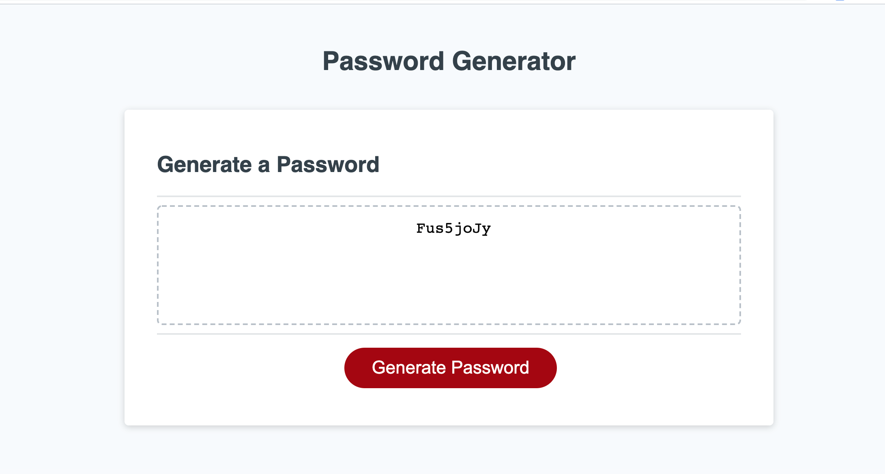
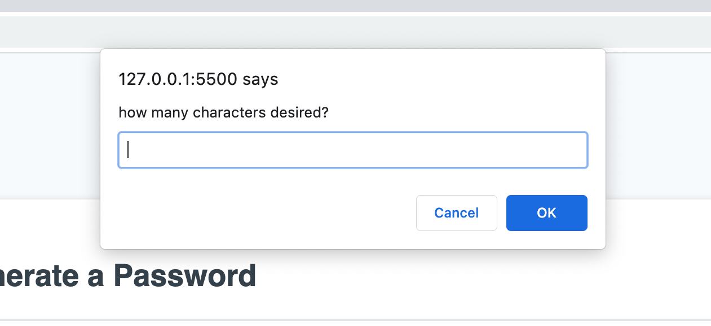
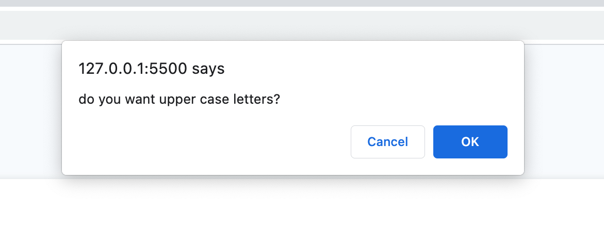

# Password Generator
    
## Table of Contents
* [Description](#description) 
* [Installation](#installation)
* [Usage](#usage)
* [Credits](#credits)
* [License](#license)
* [Badge](#badge)
* [Questions](#questions)
    
## Description
* automatic random password generator
    
## Installation
* no installation necessary.  use any web browser to open web site and create password by following prompts.
    
## Usage
* use web browser to follow prompts after hitting the generate password button.  Once all prompts have been answered with ok, cancel or number of characters password will appear in box.

    
## Credits
* N/A
    
## License
* Licensed by mit
    
## Badge
* 
    
## Questions
* For any questions, concerns, or additional help, please contact klucas72@hotmail.com.